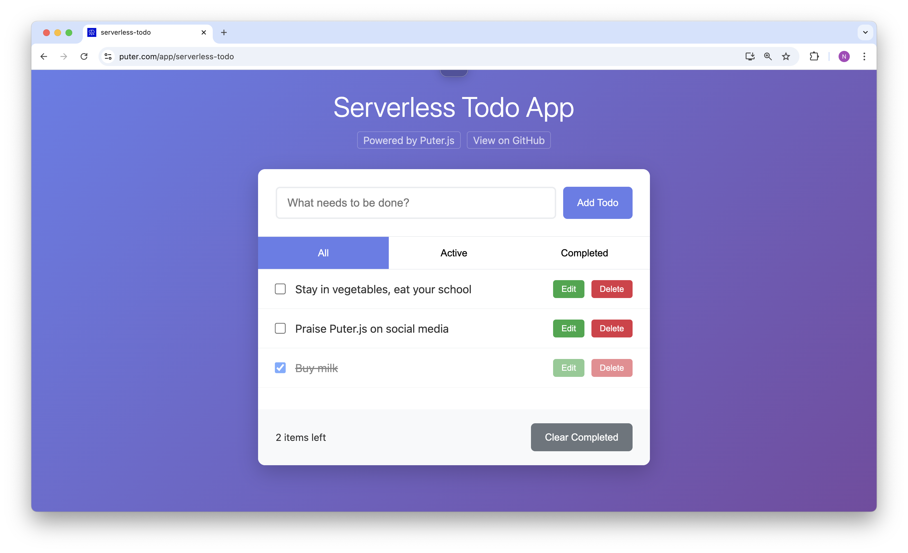

<h1 align="center">
  <a href="https://puter.com/app/serverless-todo" target="_blank">Serverless Todo App</a>
</h1>

<p align="center">A todo application that syncs your tasks to the cloud using Puter.js - no backend required!
</p>

<p align="center">
  
</p>

<br>

## Todo App

This app is a simple cloud todo list that allows you to add, edit, and delete todos. It uses [Puter.js](https://developer.puter.com) to sync your todos to the cloud. Specifically, the application uses [`puter.kv.get()`](https://docs.puter.com/Key-Value-Store/get/) and [`puter.kv.set()`](https://docs.puter.com/Key-Value-Store/set/) to read and write todo data to the cloud.


<br>

## Getting Started

Clone the repository: 

```bash
git clone https://github.com/puter-apps/serverless-todo.git
```

and open the `index.html` file in any hosted environment (you can use [`http-server`](https://www.npmjs.com/package/http-server) to serve the app locally).


<br>

## How It Works

This Todo App leverages [**Puter.js**](https://developer.puter.com/) to provide cloud database without requiring any backend infrastructure. Traditional todo apps need a server to store data, but this app uses Puter's cloud infrastructure to handle all data persistence automatically.

Specifically, the application uses [`puter.kv.get()`](https://docs.puter.com/kv/get/) and [`puter.kv.set()`](https://docs.puter.com/kv/set/) to read and write todo data to the cloud.

The app automatically handles authentication, data synchronization, and conflict resolution through Puter's infrastructure.

<br>

## License

MIT 
